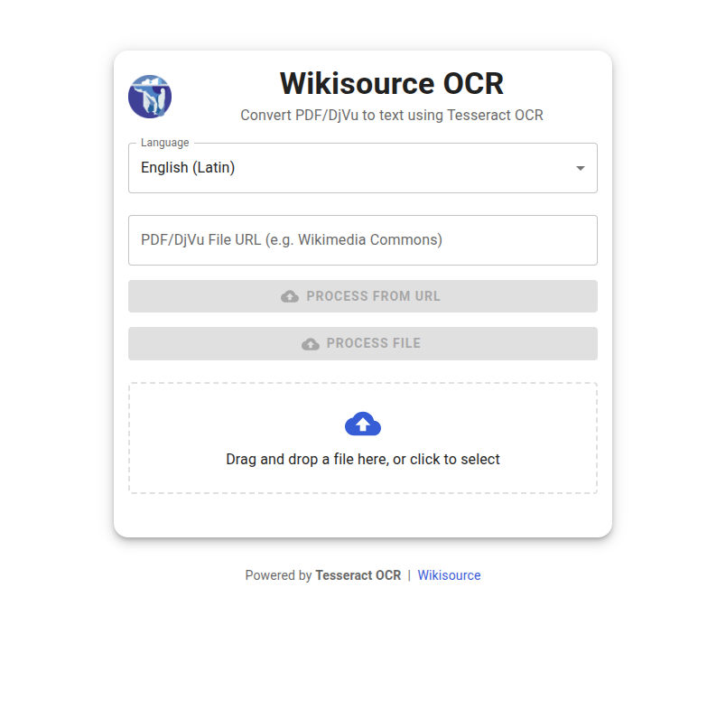
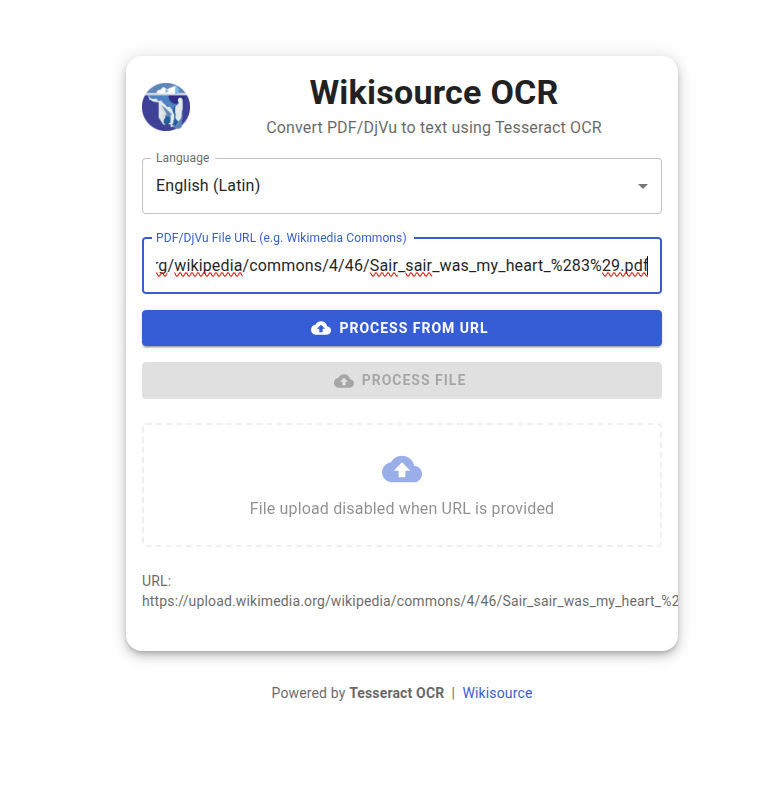
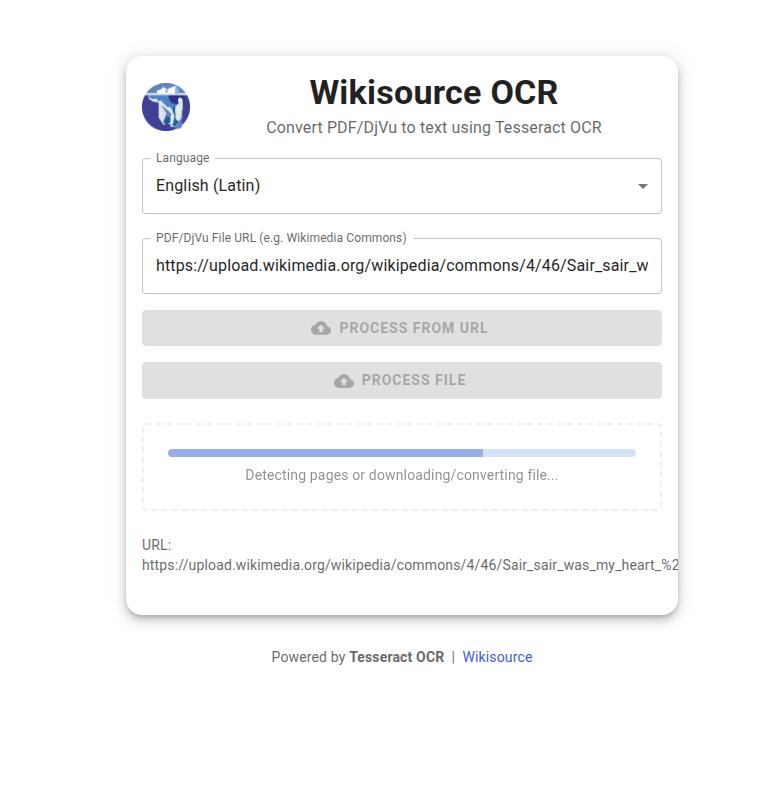
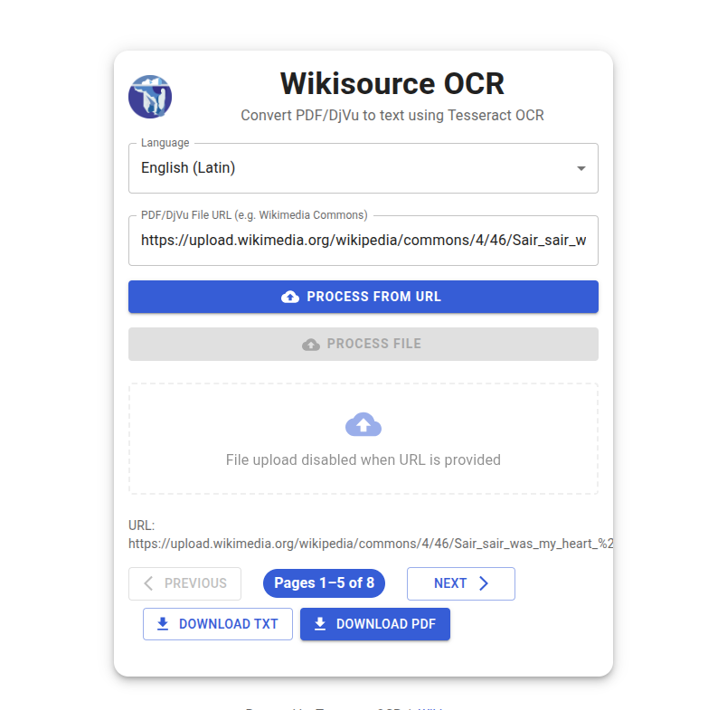

# Wikisource OCR

A modern, open-source web application for performing Optical Character Recognition (OCR) on PDF/DjVu files and preparing them for upload to Wikisource.

## Snapshots

Below is a snapshot of the Wikisource OCR user interface:







## Features

- Drag-and-drop interface for file uploads
- Support for multiple file formats (PNG, JPG, TIFF, PDF, DjVu)
- Multi-page document support
- Multiple language support
- Real-time text preview and editing
- Direct Wikisource format export

## System Requirements

- Ubuntu 24.04 LTS or later
- Python 3.8+
- Node.js 16+
- Tesseract OCR

## Installation

1. Clone the repository:
```bash
git clone <repository-url>
cd wikisource-ocr
```

2. Install system dependencies:
```bash
sudo apt-get update
sudo apt-get install -y djvulibre-bin libdjvulibre21 libtiff-tools mupdf mupdf-tools pdftk poppler-utils git djview tesseract-ocr
```

3. Install Python dependencies:
```bash
pip install -r requirements.txt
```

4. Install frontend dependencies:
```bash
cd frontend
npm install
```

5. Create configuration:
```bash
cp config.ini.example config.ini
# Edit config.ini with your settings
```

## Usage

1. Start the backend server:
```bash
python backend/app.py
```

2. Start the frontend development server:
```bash
cd frontend
npm start
```

3. Open your browser and navigate to `http://localhost:3000`

## Project Structure

```
wikisource-ocr/
├── backend/              # Python backend
│   ├── app.py           # Main application
│   ├── ocr/             # OCR processing modules
│   └── utils/           # Utility functions
├── frontend/            # React frontend
│   ├── src/            # Source code
│   └── public/         # Static assets
├── config/             # Configuration files
├── scripts/            # Utility scripts
└── tests/             # Test files
```

## Contributing

1. Fork the repository
2. Create your feature branch
3. Commit your changes
4. Push to the branch
5. Create a Pull Request

## License

This project is licensed under the MIT License - see the LICENSE file for details. 