# Wikisource OCR: How It Works

## Overview
Wikisource OCR is a web application that allows users to extract text from PDF, DjVu, and image files using Tesseract OCR. It supports multiple languages (including Indian scripts), batch processing, and provides output as TXT or PDF files. The app consists of a React frontend and a Flask backend.

---

## 1. Frontend (React)
- **File/URL Input:** Users can upload a file or provide a direct URL (e.g., from Wikimedia Commons).
- **Language Selection:** A dropdown lists supported languages, fetched from the backend.
- **Batch Navigation:** For multi-page documents, users can process in batches (default: 5 pages at a time) and navigate using Previous/Next buttons.
- **Progress & Status:** Progress bars and status messages inform users about ongoing operations.
- **Download Options:** After OCR, users can download the result as TXT or PDF.

### Key Mechanisms
- **State Management:** React hooks manage file, URL, language, batch, and result states.
- **API Calls:** Uses Axios to communicate with the backend for OCR and language list.
- **UX:** Disables file upload when a URL is provided, disables buttons during processing, and shows clear error messages.

---

## 2. Backend (Flask)
- **Endpoints:**
  - `/api/languages`: Returns a list of supported languages from `config/languages.json`.
  - `/api/ocr`: Handles OCR requests for TXT output.
  - `/api/ocr/pdf`: Handles OCR requests and returns a PDF with recognized text.
- **File Handling:** Accepts either an uploaded file or a URL. Downloads files from Wikimedia Commons if needed.
- **Batch Processing:**
  - Splits multi-page PDFs/DjVus into batches (default: 5 pages).
  - Only processes the current batch to optimize memory and speed.
- **OCR Processing:**
  - Uses `pytesseract` to run Tesseract OCR on each page/image.
  - Supports multiple languages and scripts (with Unicode font support for PDF output).
- **PDF Generation:**
  - Uses `reportlab` to generate PDFs with recognized text, embedding appropriate fonts for Indian scripts.
- **Error Handling:**
  - Returns clear error messages for unsupported files, download failures, or OCR issues.

---

## 3. Batch Processing
- **Why:** Large documents are split into smaller, manageable batches to avoid memory issues and improve user experience.
- **How:**
  - The frontend tracks the current batch and requests only those pages from the backend.
  - The backend uses `pdf2image` to convert only the required pages to images, then runs OCR.
  - Users can navigate between batches and download results for each batch.

---

## 4. Language Handling
- **Frontend:** Fetches available languages from the backend and allows the user to select one.
- **Backend:** Maps language codes to Tesseract and font files. Ensures correct OCR and PDF output for each script.
- **Config:** Languages are defined in `config/languages.json` for easy extension.

---

## 5. Download Mechanism
- **TXT Download:**
  - The frontend creates a Blob from the recognized text and triggers a download.
- **PDF Download:**
  - The frontend requests `/api/ocr/pdf` for the current batch.
  - The backend generates a PDF in memory and sends it as a response.
  - The frontend triggers the download using a Blob and a temporary link.

---

## 6. Error Handling & Feedback
- **Frontend:** Shows error messages for missing input, failed requests, or backend errors.
- **Backend:** Returns JSON error messages for invalid input, download failures, or processing errors.

---

## 7. Security & Privacy
- All processing is local (no third-party cloud services).
- Temporary files are cleaned up after processing.
- No user data is stored on the server.

---

## 8. Extensibility
- **Languages:** Add new languages/scripts by updating `config/languages.json` and adding font files if needed.
- **Batch Size:** Can be changed in the frontend and backend configs.
- **Output Formats:** TXT and PDF supported; can be extended to other formats.

---

## 9. File Storage & Scanning Process
- **Temporary Storage:**
  - When a file is uploaded or downloaded from a URL, it is saved temporarily on the server in the `uploads/` directory (for uploads) or as a temporary file (for URLs).
  - For DjVu files, they are first converted to PDF and stored in a temporary directory.
- **Image Conversion:**
  - For PDFs and DjVus, only the required batch of pages is converted to images using `pdf2image` (for PDFs) or `ddjvu` + `pdf2image` (for DjVu).
  - Images are processed in-memory and not permanently stored on disk.
- **OCR Scanning:**
  - Each image (page) is scanned using Tesseract OCR via the `pytesseract` library.
  - The recognized text is collected for each page in the batch.
- **Cleanup:**
  - After processing, all temporary files (including images and PDFs) are deleted to save space and protect privacy.

---

## 10. Challenges Faced with Long PDF Scanning
- **High Memory Usage:**
  - Processing entire long PDFs at once would consume a lot of memory, especially when converting all pages to images before OCR.
- **Slow Processing Time:**
  - Large files took a long time to process, leading to timeouts or browser/server unresponsiveness.
- **File Size and Upload Limits:**
  - Some browsers and servers have limits on file upload size, making it difficult to handle very large documents.
- **Resource Exhaustion:**
  - Running OCR on hundreds of pages at once could exhaust CPU and RAM, causing crashes or failures.
- **User Experience:**
  - Users had to wait a long time for results, with no feedback or progress indication.

### Solution: Batch Processing
- The app was redesigned to process documents in small batches (e.g., 5 pages at a time).
- Only the current batch of pages is converted and scanned, reducing memory and CPU usage.
- Users can navigate between batches, making the process interactive and manageable.
- Progress bars and clear status messages were added to improve user experience.

---

## Summary
Wikisource OCR provides a robust, user-friendly interface for extracting text from multi-page documents in many languages, with efficient batch processing and reliable download options. The separation of frontend and backend, clear API design, and strong error handling make it easy to maintain and extend.

---

## Data Flow Diagrams (DFD)

### 1. System Overview
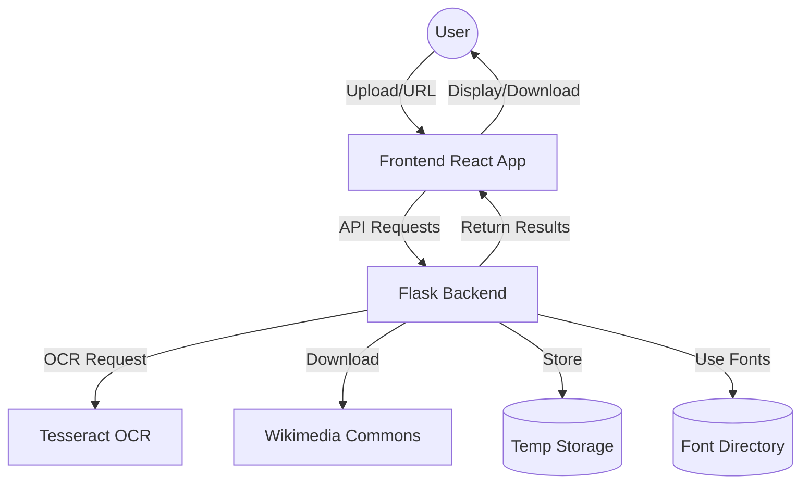

### 2. File Processing Flow
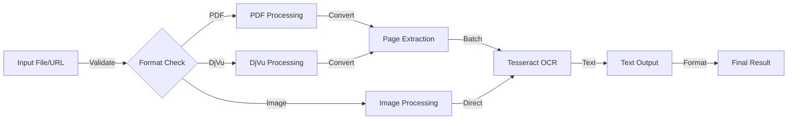

### 3. Batch Processing Flow
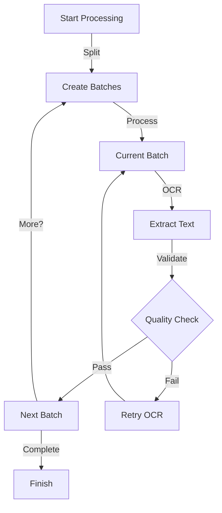

### 4. Language Processing Flow
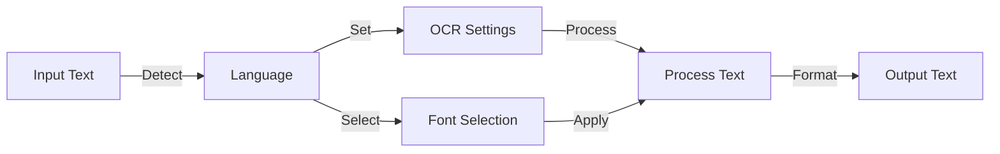

### 5. Error Handling Flow
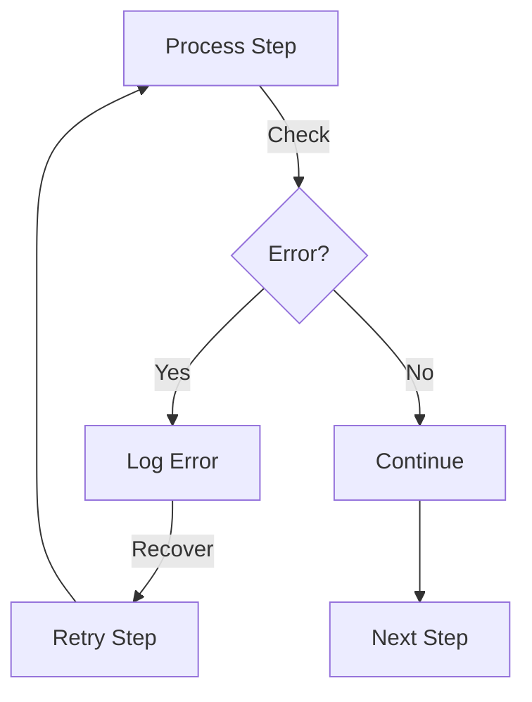

### 6. Resource Management
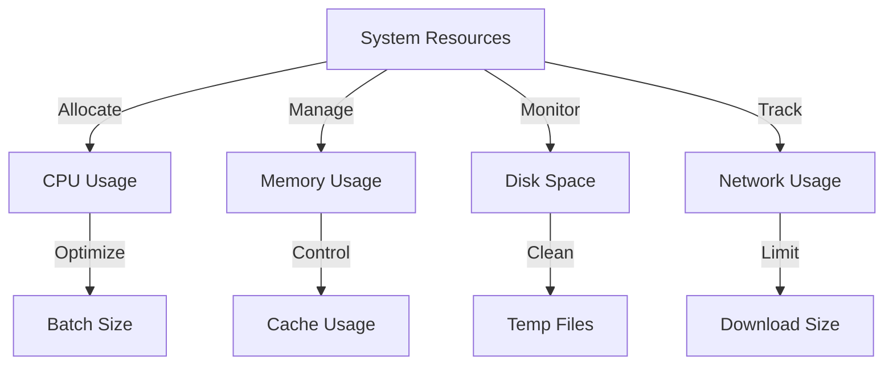

### 7. Output Generation Flow
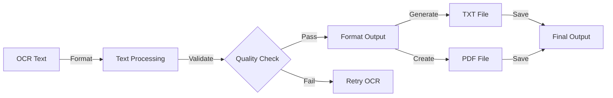

### 8. User Interaction Flow
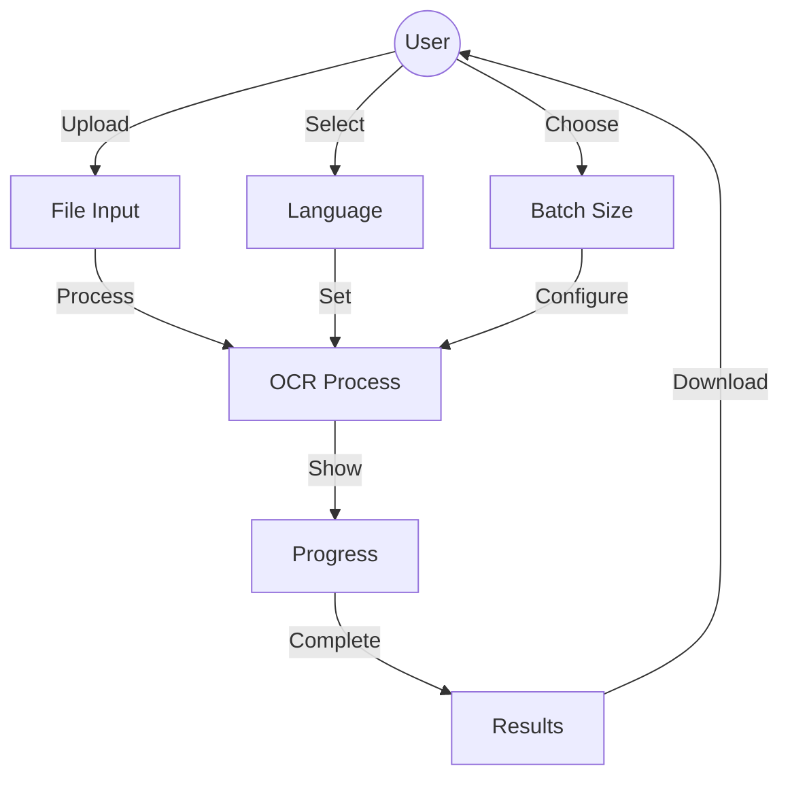

### 9. Data Storage Flow
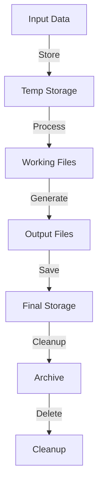

### 10. Quality Control Flow
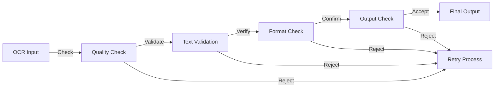

---

### 11. Deep Scan App DFD
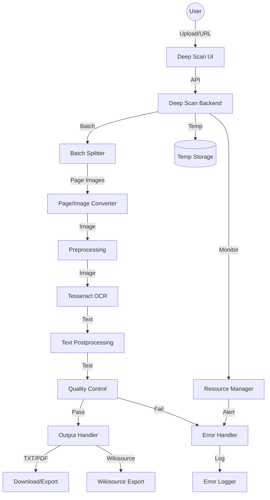